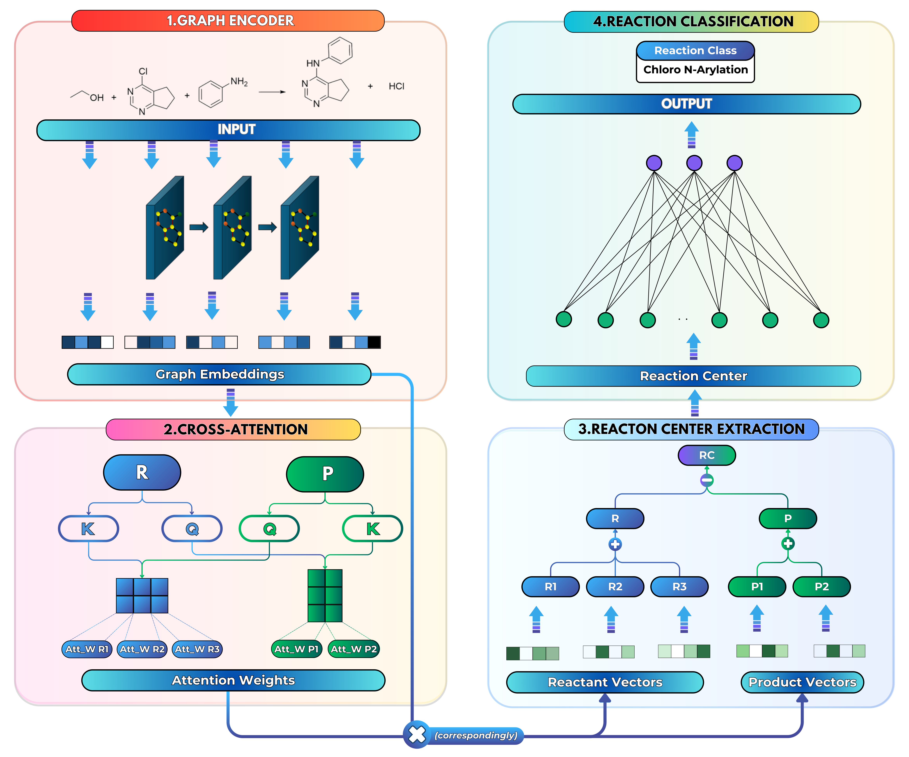

# SynCat

**SynCat** is a novel graph-based framework for classifying chemical reactions by leveraging molecule-level cross-attention for precise reagent detection and role assignment. To overcome the limitations of existing methods, it ensures permutation invariance through a pairwise summation of participant embeddings, which balances mechanistic specificity with an order-independent representation. This approach has demonstrated superior performance over established fingerprints like **DRFP** and **RXNFP**, achieving a mean classification accuracy of 0.988 and enhanced scalability on benchmark datasets.




## Step-by-Step Installation Guide

1. **Python Installation:**
  Ensure that Python 3.11 or later is installed on your system. You can download it from [python.org](https://www.python.org/downloads/).

2. **Creating a Virtual Environment (Optional but Recommended):**
  It's recommended to use a virtual environment to avoid conflicts with other projects or system-wide packages. Use the following commands to create and activate a virtual environment:

  ```bash
  python -m venv syncat-env
  source syncat-env/bin/activate  
  ```
  Or Conda

  ```bash
  conda create --name syncat-env python=3.11
  conda activate syncat-env
  ```

3. **Cloning and Installing SynCat:**
  Clone the SynCat repository from GitHub and install it:

  ```bash
  git clone https://github.com/phuocchung123/SynCat.git
  cd SynCat
  pip install -r requirements.txt
  pip install black flake8 pytest # black for formating, flake8 for checking format, pytest for testing
  ```


## Setting Up Your Development Environment

Before you start, ensure your local development environment is set up correctly. Pull the latest version of the `main` branch to start with the most recent stable code.

```bash
git checkout main
git pull
```

## Working on New Features

1. **Create a New Branch**:  
   For every new feature or bug fix, create a new branch from the `main` branch. Name your branch meaningfully, related to the feature or fix you are working on.

   ```bash
   git checkout -b feature/your-feature-name
   ```

2. **Develop and Commit Changes**:  
   Make your changes locally, commit them to your branch. Keep your commits small and focused; each should represent a logical unit of work.

   ```bash
   git commit -m "Describe the change"
   ```

3. **Run Quality Checks**:  
   Before finalizing your feature, run the following commands to ensure your code meets our formatting standards and passes all tests:

   ```bash
   ./lint.sh # Check code format
   pytest Test # Run tests
   ```

   Fix any issues or errors highlighted by these checks.

## Integrating Changes

1. **Rebase onto Staging**:  
   Once your feature is complete and tests pass, rebase your changes onto the `staging` branch to prepare for integration.

   ```bash
   git fetch origin
   git rebase origin/staging
   ```

   Carefully resolve any conflicts that arise during the rebase.

2. **Push to Your Feature Branch**:
   After successfully rebasing, push your branch to the remote repository.

   ```bash
   git push origin feature/your-feature-name
   ```

3. **Create a Pull Request**:
   Open a pull request from your feature branch to the `staging` branch. Ensure the pull request description clearly describes the changes and any additional context necessary for review.

## Contributing
- [Phuoc-Chung Nguyen Van](https://github.com/phuocchung123)
- [Tieu-Long Phan](https://tieulongphan.github.io/)

## Publication

[SynCat: A light weight graph neural network model to classify chemical reactions](https://doi.org/10.26434/chemrxiv-2025-5f868)

## License
This project is licensed under MIT License - see the [License](LICENSE) file for details.

## Acknowledgments

This project has received funding from the European Unions Horizon Europe Doctoral Network programme under the Marie-Skłodowska-Curie grant agreement No 101072930 ([TACsy](https://tacsy.eu/) -- Training Alliance for Computational)