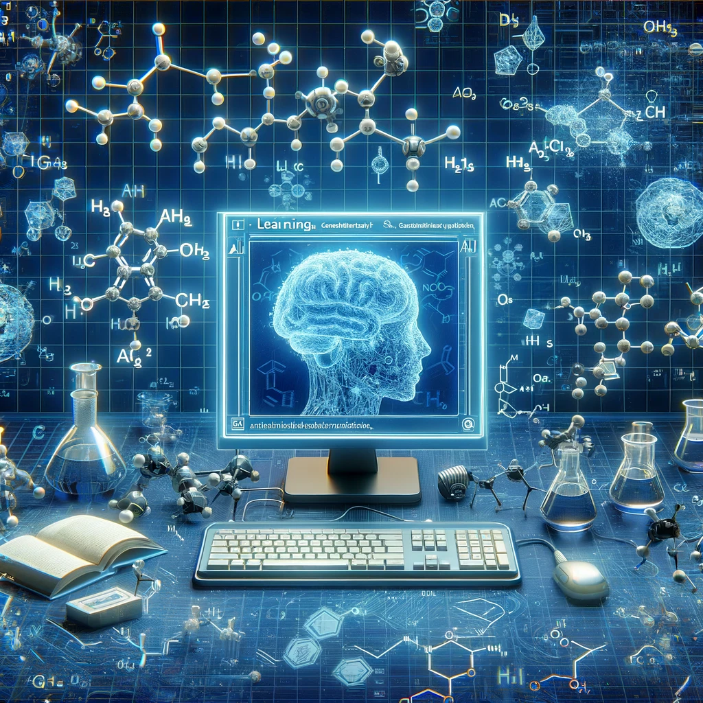

# SynCat

ReCatAI is a cutting-edge repository dedicated to harnessing the power of artificial intelligence to categorize chemical reactions, particularly within the realm of organic chemistry. This project aims to bridge the gap between traditional chemical analysis and modern computational methodologies, offering a novel approach to understanding and organizing chemical reactions.

