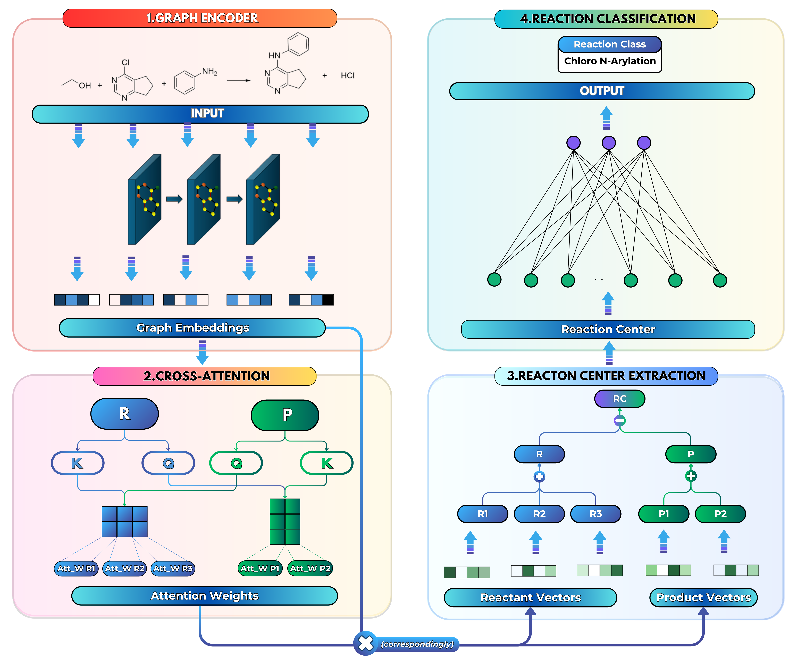

# SynCat

**SynCat** is a novel graph-based framework for classifying chemical reactions by leveraging molecule-level cross-attention for precise reagent detection and role assignment. To overcome the limitations of existing methods, it ensures permutation invariance through a pairwise summation of participant embeddings, which balances mechanistic specificity with an order-independent representation. This approach has demonstrated superior performance over established fingerprints like **DRFP** and **RXNFP**, achieving a mean classification accuracy of 0.988 and enhanced scalability on benchmark datasets.




## Step-by-Step Installation Guide

1. **Python Installation:**
  Ensure that Python 3.11 or later is installed on your system. You can download it from [python.org](https://www.python.org/downloads/).

2. **Creating a Virtual Environment (Optional but Recommended):**
  It's recommended to use a virtual environment to avoid conflicts with other projects or system-wide packages. Use the following commands to create and activate a virtual environment:

  ```bash
  python -m venv syncat-env
  source syncat-env/bin/activate  
  ```
  Or Conda

  ```bash
  conda create --name syncat-env python=3.11
  conda activate syncat-env
  ```

3. **Cloning and Installing SynCat:**
  Clone the SynCat repository from GitHub and install it:

  ```bash
  git clone https://github.com/phuocchung123/SynCat.git
  cd SynCat
  pip install -r requirements.txt
  pip install black flake8 pytest # black for formating, flake8 for checking format, pytest for testing
  ```


## Reaction-Yield Regression

Three datasets are supported. They differ in **where the train/test split comes from** and in **the unit of the target**, which changes the command you run:

| Dataset | File | Target column | Target unit | Split |
| --- | --- | --- | --- | --- |
| Suzuki (10 random splits) | `Data/raw/suzuki/random_split_<id>.tsv` | `y` | fraction, 0–1 | row order of the file (70/30), via `--stage` |
| USPTO above | `Data/raw/uspto_yields_above.csv.gz` | `yield` | percent, 0–100 | the file's own `split` column |
| USPTO below | `Data/raw/uspto_yields_below.csv.gz` | `yield` | percent, 0–100 | the file's own `split` column |

Every run has the same two stages: **prepare** (read the table, split it, featurize each molecule with RDKit, write `train.npz`, `valid.npz`, `test.npz`) and **train** (train, select the best-validation checkpoint, evaluate it once on the test set). Preparation is single-threaded CPU work and is by far the slower of the two for USPTO; the npz files are written once and reused by every later training run.

All commands run from `src/`.

### Dataset 1-2: USPTO above / below

These files carry a `split` column holding `train`/`test`, so `--train_test_split` tells the pipeline to use it instead of splitting the table itself. The validation set is carved out of the train rows (10%, `--valid_ratio`). Nothing else about the data is modified: no row is dropped, no value rescaled.

**Stage 1 — prepare (~70 min for above, ~110 min for below):**

```bash
python main_finetune.py --prepare_only \
  --data_csv raw/uspto_yields_above.csv.gz \
  --npz_folder npz/npz_uspto_above \
  --train_test_split --reaction_column rxn --y_column yield
```

Swap `above` for `below` in both paths for the other file. `--prepare_only` stops the script before training. Progress is logged every 10,000 reactions to `Data/monitor/monitor.log`.

**Stage 2 — train:**

```bash
python main_finetune.py \
  --data_csv raw/uspto_yields_above.csv.gz \
  --npz_folder npz/npz_uspto_above \
  --model_name model_uspto_above.pt \
  --train_test_split --reaction_column rxn --y_column yield \
  --reaction_combine concat_sub --epochs 100 --patience 10 --batch_size 128
```

Preparation is skipped automatically because the npz folder already holds files, so this goes straight to training.

**Both stages in one command:** drop `--prepare_only` from stage 1 and add the training options — preparation then runs first and training follows in the same process.

Notes specific to these datasets:

- **Give each run its own `--model_name`.** An existing checkpoint at `--model_path/--model_name` is treated as a run to *resume*, so reusing the Suzuki default `model_yield.pt` would pick up its weights.
- **Metrics are in percentage points**, because the targets stay at their original 0–100 scale. A USPTO `MAE: 20.0 pp` corresponds to a Suzuki `MAE: 0.20`; don't compare the raw numbers across the two datasets. R² and Pearson are scale-free and stay comparable.
- **Padding follows the data**: 58 reactant slots for *above*, 36 for *below*, against 14 for Suzuki. That is the number of GNN passes per batch, so USPTO trains several times slower per reaction and its npz files are correspondingly larger.
- **Known issue:** `uspto_yields_below` contains at least one SMILES that RDKit cannot parse, and `reaction_data.py` raises `Boost.Python.ArgumentError` on it during preparation. Preparing that file requires deciding what to do with those rows first.

### Dataset 3: Suzuki, a single split file

For one `random_split_<id>.tsv` outside the multi-split pipeline, the defaults already point at Suzuki (`--reaction_column rxn`, `--y_column y`), and the split comes from row order rather than a column, so **no** `--train_test_split`:

```bash
# prepare only
python main_finetune.py --prepare_only \
  --data_csv raw/suzuki/random_split_0.tsv --npz_folder npz/npz_yield \
  --split_strategy ordered

# train
python main_finetune.py \
  --data_csv raw/suzuki/random_split_0.tsv --npz_folder npz/npz_yield \
  --model_name model_yield.pt --epochs 100 --patience 10
```

`--split_strategy ordered` reproduces the file's intended 70/30 division (the last 30% of rows are the test set); `shuffle` re-splits randomly with `--seed`.

### Model options (all datasets)

| Option | Default | Meaning |
| --- | --- | --- |
| `--reaction_combine` | `concat` | how the reactant vector `r` and product vector `p` form the reaction vector: `concat` `[r, p]`, `sum`, `sub` (`p - r`), `mul`, `concat_sub` `[r, p, p - r]`, `interaction` `[r, p, \|p - r\|, r * p]` |
| `--attention_layer` | `1` | self-attention layers over the reactants |
| `--num_heads` | `1` | attention heads; must divide `--emb_dim` |
| `--layer` / `--emb_dim` | `3` / `384` | GINE layers and embedding size |
| `--dropout`, `--lr`, `--weight_decay` | `0.1`, `1e-3`, `1e-4` | optimization |
| `--patience` | `0` | early-stopping patience on validation loss (0 disables) |
| `--track_test_each_epoch` | off | also score the test set each epoch, for monitoring only |

Self-attention is applied to the reactants only (everything left of `>>`); their attended value vectors are averaged into `r`, the product embeddings are averaged into `p`, and `--reaction_combine` decides how the two become the reaction vector.

### Outputs

| Path | Content |
| --- | --- |
| `Data/npz/<npz_folder>/{train,valid,test}.npz` | prepared graphs, reused across runs |
| `Data/model/<model_name>` | best-validation checkpoint, including its architecture config |
| `Data/monitor/monitor.log` | preparation progress, per-epoch losses, final test metrics |
| `Data/monitor/embedding.json` | reaction embeddings of the test set |
| `Image/` | `loss_curve.png`, `metric_curves.png`, `test_parity.png` |

## Suzuki Reaction-Yield Regression on 10 Random Splits

The raw splits are `Data/raw/suzuki/random_split_<id>.tsv` (columns: original sample id, `rxn`, `y`). Each file holds the full dataset in a different random order. For split `<id>`, the first 70% of rows form train1 and the last 30% the test set; train1 is divided 90/10 into train/valid with seed `42 + <id>` (≈63/7/30 overall).

The pipeline has two strictly separated stages. Run all commands from `src/`:

```bash
# 1. prepare splits 0-9 -> Data/processed/suzuki/npz/split_<id>/{train,valid,test}.npz + split_metadata.json
python main_finetune.py --stage prepare
# 2. validate all prepared files (exits non-zero if any split is invalid)
python main_finetune.py --stage validate
# 3. train/evaluate every split from the npz files (re-validates all splits first)
python main_finetune.py --stage train --epochs 1
# 4. complete workflow: prepare -> validate -> train
python main_finetune.py --stage all --epochs 1
```

Valid prepared splits are skipped and missing/invalid ones regenerated (`--overwrite` forces regeneration). Results go to `logs/suzuki_regression/`: `suzuki_splits_0_to_9.log`, `suzuki_splits_0_to_9_results.csv` (per split), `suzuki_splits_0_to_9_summary.csv` (mean/std over successful runs), `suzuki_splits_0_to_9_test_predictions.csv`, and a per-run folder with checkpoints and training curves. Existing result files are never replaced unless `--overwrite_results` is given. Use `--split_ids` to select splits.

**Multi-GPU training.** Add `--gpus 0 1` (or `--gpus all`) to any training command to train with DistributedDataParallel, one process per GPU. The script starts the processes itself, so you don't need `torchrun`. `--batch_size` stays the total batch size and is split evenly across the GPUs (128 → 64 per GPU on 2 GPUs). Validation, checkpointing and the final test evaluation run on the first GPU. Without `--gpus`, training uses the single GPU given by `--device`.

```bash
python main_finetune.py --stage train --gpus 0 1 --epochs 100 --patience 10
python run_splits_sequential.py --gpus 0 1 --epochs 100 --patience 10
```

## Setting Up Your Development Environment

Before you start, ensure your local development environment is set up correctly. Pull the latest version of the `main` branch to start with the most recent stable code.

```bash
git checkout main
git pull
```

## Working on New Features

1. **Create a New Branch**:  
   For every new feature or bug fix, create a new branch from the `main` branch. Name your branch meaningfully, related to the feature or fix you are working on.

   ```bash
   git checkout -b feature/your-feature-name
   ```

2. **Develop and Commit Changes**:  
   Make your changes locally, commit them to your branch. Keep your commits small and focused; each should represent a logical unit of work.

   ```bash
   git commit -m "Describe the change"
   ```

3. **Run Quality Checks**:  
   Before finalizing your feature, run the following commands to ensure your code meets our formatting standards and passes all tests:

   ```bash
   ./lint.sh # Check code format
   pytest Test # Run tests
   ```

   Fix any issues or errors highlighted by these checks.

## Integrating Changes

1. **Rebase onto Staging**:  
   Once your feature is complete and tests pass, rebase your changes onto the `staging` branch to prepare for integration.

   ```bash
   git fetch origin
   git rebase origin/staging
   ```

   Carefully resolve any conflicts that arise during the rebase.

2. **Push to Your Feature Branch**:
   After successfully rebasing, push your branch to the remote repository.

   ```bash
   git push origin feature/your-feature-name
   ```

3. **Create a Pull Request**:
   Open a pull request from your feature branch to the `staging` branch. Ensure the pull request description clearly describes the changes and any additional context necessary for review.

## Contributing
- [Phuoc-Chung Nguyen Van](https://github.com/phuocchung123)
- [Tieu-Long Phan](https://tieulongphan.github.io/)

## Publication

[SynCat: molecule-level attention graph neural network for precise reaction classification](https://doi.org/10.1039/D5DD00367A)

### Citation
```
@article{van2025syncat,
author ={Van Nguyen, Phuoc-Chung and To, Van-Thinh and Tran, Nguyen Ngoc Vi and Phan, Tieu-Long and Truong, Tuyen Ngoc and Gärtner, Thomas and Merkle, Daniel and Stadler, Peter},
title  ={SynCat: Molecule-Level Attention Graph Neural Network for Precise Reaction Classification},
journal  ={Digital Discovery},
year  ={2025},
pages  ={-},
publisher  ={RSC},
doi  ={10.1039/D5DD00367A},
url  ={http://dx.doi.org/10.1039/D5DD00367A}
}
```

## License
This project is licensed under MIT License - see the [License](LICENSE) file for details.

## Acknowledgments

This project has received funding from the European Unions Horizon Europe Doctoral Network programme under the Marie-Skłodowska-Curie grant agreement No 101072930 ([TACsy](https://tacsy.eu/) -- Training Alliance for Computational)