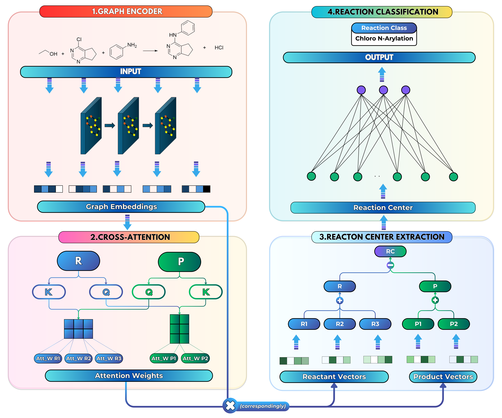

# SynCat

**SynCat** is a novel graph-based framework for classifying chemical reactions by leveraging molecule-level cross-attention for precise reagent detection and role assignment. To overcome the limitations of existing methods, it ensures permutation invariance through a pairwise summation of participant embeddings, which balances mechanistic specificity with an order-independent representation. This approach has demonstrated superior performance over established fingerprints like **DRFP** and **RXNFP**, achieving a mean classification accuracy of 0.988 and enhanced scalability on benchmark datasets.




## Step-by-Step Installation Guide

1. **Python Installation:**
  Ensure that Python 3.11 or later is installed on your system. You can download it from [python.org](https://www.python.org/downloads/).

2. **Creating a Virtual Environment (Optional but Recommended):**
  It's recommended to use a virtual environment to avoid conflicts with other projects or system-wide packages. Use the following commands to create and activate a virtual environment:

  ```bash
  python -m venv syncat-env
  source syncat-env/bin/activate  
  ```
  Or Conda

  ```bash
  conda create --name syncat-env python=3.11
  conda activate syncat-env
  ```

3. **Cloning and Installing SynCat:**
  Clone the SynCat repository from GitHub and install it:

  ```bash
  git clone https://github.com/phuocchung123/SynCat.git
  cd SynCat
  pip install -r requirements.txt
  pip install black flake8 pytest # black for formating, flake8 for checking format, pytest for testing
  ```


## Reaction-Yield Regression

Three datasets are supported. They differ in **where the train/test split comes from** and in **the unit of the target**, which changes the command you run:

| Dataset | File | Target column | Target unit | Split |
| --- | --- | --- | --- | --- |
| Suzuki (10 random splits) | `Data/raw/suzuki/random_split_<id>.tsv` | `y` | fraction, 0–1 | row order of the file (70/30), via `--stage` |
| USPTO above | `Data/raw/uspto_yields_above.csv.gz` | `yield` | percent, 0–100 | the file's own `split` column |
| USPTO below | `Data/raw/uspto_yields_below.csv.gz` | `yield` | percent, 0–100 | the file's own `split` column |
| Buchwald-Hartwig | `Data/raw/BH/FullCV_<01..10>.csv`, `Data/raw/BH/Test<1..4>.csv` | `Output` | percent, 0–100 | one train/test column per training fraction (`split_70` … `split_2.5`); `split` in the Test files |

Every run has the same two stages: **prepare** (read the table, split it, featurize each molecule with RDKit, write `train.npz`, `valid.npz`, `test.npz`) and **train** (train, select the best-validation checkpoint, evaluate it once on the test set). Preparation is single-threaded CPU work and is by far the slower of the two for USPTO; the npz files are written once and reused by every later training run.

All commands run from `src/`.

### Dataset 1-2: USPTO above / below

These files carry a `split` column holding `train`/`test`, so `--train_test_split` tells the pipeline to use it instead of splitting the table itself. The validation set is carved out of the train rows (10%, `--valid_ratio`). Nothing else about the data is modified: no row is dropped, no value rescaled.

**Stage 1 — prepare (~70 min for above, ~110 min for below):**

```bash
python main_finetune.py --prepare_only \
  --data_csv raw/uspto_yields_above.csv.gz \
  --npz_folder npz/npz_uspto_above \
  --train_test_split --reaction_column rxn --y_column yield
```

Swap `above` for `below` in both paths for the other file. `--prepare_only` stops the script before training. Progress is logged every 10,000 reactions to `Data/monitor/monitor.log`.

**Stage 2 — train:**

```bash
python main_finetune.py \
  --data_csv raw/uspto_yields_above.csv.gz \
  --npz_folder npz/npz_uspto_above \
  --model_name model_uspto_above.pt \
  --train_test_split --reaction_column rxn --y_column yield \
  --reaction_combine concat_sub --epochs 100 --patience 10 --batch_size 128
```

Preparation is skipped automatically because the npz folder already holds files, so this goes straight to training.

**Both stages in one command:** drop `--prepare_only` from stage 1 and add the training options — preparation then runs first and training follows in the same process.

Notes specific to these datasets:

- **Give each run its own `--model_name`.** An existing checkpoint at `--model_path/--model_name` is treated as a run to *resume*, so reusing the Suzuki default `model_yield.pt` would pick up its weights.
- **Metrics are in percentage points**, because the targets stay at their original 0–100 scale. A USPTO `MAE: 20.0 pp` corresponds to a Suzuki `MAE: 0.20`; don't compare the raw numbers across the two datasets. R² and Pearson are scale-free and stay comparable.
- **Padding follows the data**: 58 reactant slots for *above*, 36 for *below*, against 14 for Suzuki. That is the number of GNN passes per batch, so USPTO trains several times slower per reaction and its npz files are correspondingly larger.
- **Known issue:** `uspto_yields_below` contains at least one SMILES that RDKit cannot parse, and `reaction_data.py` raises `Boost.Python.ArgumentError` on it during preparation. Preparing that file requires deciding what to do with those rows first.

### Dataset 3: Suzuki, a single split file

For one `random_split_<id>.tsv` outside the multi-split pipeline, the defaults already point at Suzuki (`--reaction_column rxn`, `--y_column y`), and the split comes from row order rather than a column, so **no** `--train_test_split`:

```bash
# prepare only
python main_finetune.py --prepare_only \
  --data_csv raw/suzuki/random_split_0.tsv --npz_folder npz/npz_yield \
  --split_strategy ordered

# train
python main_finetune.py \
  --data_csv raw/suzuki/random_split_0.tsv --npz_folder npz/npz_yield \
  --model_name model_yield.pt --epochs 100 --patience 10
```

`--split_strategy ordered` reproduces the file's intended 70/30 division (the last 30% of rows are the test set); `shuffle` re-splits randomly with `--seed`.

### Dataset 4: Buchwald-Hartwig

The BH folder holds 14 tables of the same 3,955 reactions. `FullCV_01` … `FullCV_10` are ten replicates that each carry **seven** train/test columns, one per training fraction (`split_70`, `split_50`, `split_30`, `split_20`, `split_10`, `split_5`, `split_2.5`), so one file yields seven different experiments — hence `--split_column`. `Test1` … `Test4` are out-of-sample tables with a single `split` column.

Because one raw file maps to several experiments, two helper scripts drive the work. Both are resumable: re-run them and they continue where they stopped.

**Stage 1 — prepare.** One npz folder per (file, split column), written to `Data/npz/bh/`:

```bash
python prepare_bh.py --dry_run                       # print the plan, prepare nothing
python prepare_bh.py --split_columns split_70        # 10 CV folders + Test1-4 (~20 min)
python prepare_bh.py                                 # all 7 columns: 74 folders (~2 h)
python prepare_bh.py --split_columns split_70 --test_ids   # CV files only
python prepare_bh.py --cv_ids                        # Test files only
```

Folder names are `npz/bh/fullcv<id>_split<column>` (e.g. `fullcv01_split70`, `fullcv07_split2_5`) and `npz/bh/test<id>`. Jobs are independent, so several of these commands can run in parallel in different terminals — give each one its own `--monitor_folder` if you want unmixed logs, and never point two at the same folder.

**Stage 2 — train.** One model per prepared folder, with the results collected into one table:

```bash
python train_bh.py --epochs 100 --patience 10                    # 10 CV + 4 Test
python train_bh.py --test_ids --epochs 100 --patience 10          # CV only
python train_bh.py --cv_ids --epochs 100 --patience 10            # Test only
python train_bh.py --cv_ids 1 2 3 --attention_on both \
  --log_dir ../logs/bh_attention_both/ --epochs 100 --patience 10
python train_bh.py --reactant_pooling rn --head mlp \
  --log_dir ../logs/bh_rn_mlp/ --epochs 100 --patience 10
```

`train_bh.py` accepts every model and training option of `main_finetune.py`, sets `--reaction_column rxn` and `--y_column Output` itself, and reads only the prepared npz folders — it never touches `Data/raw/BH`. A dataset that already succeeded is skipped (`--rerun_successful` retrains it), and a failure is recorded so the remaining datasets still run. `--split_columns` defaults to `split_70`; pass more to train the low-data fractions.

Results land in `--log_dir` (default `../logs/bh/`):

| File | Content |
| --- | --- |
| `bh_results.csv` | one row per dataset: status, best epoch, subset sizes, test MAE/RMSE/R²/Pearson, runtime |
| `bh_summary.csv` | mean and sample std (ddof=1) per metric, grouped by kind (`cv`/`test`) and split column |
| `bh_training.log` | progress across all runs |
| `runs/<dataset>/` | that run's `model.pt`, `monitor/`, `images/` |

### Model options (all datasets)

Each reaction becomes one vector in four steps: every compound is encoded by the shared GINE; `--attention_on` decides which compounds attend to each other; each side is then pooled into a reactant vector `r` and a product vector `p` (attended value vectors where attention applies, plain GINE embeddings where it does not) — the reactants as set by `--reactant_pooling`, the products always by a masked mean; and `--reaction_combine` turns `r` and `p` into the reaction vector, which `--head` maps to the predicted yield.

| Option | Default | Meaning |
| --- | --- | --- |
| `--attention_on` | `reactants` | which compounds attend to each other — see the table below |
| `--reaction_combine` | `concat` | how `r` and `p` form the reaction vector: `concat` `[r, p]`, `sum`, `sub` (`p - r`), `mul`, `concat_sub` `[r, p, p - r]`, `interaction` `[r, p, \|p - r\|, r * p]` |
| `--reactant_pooling` | `mean` | how the reactant slots form `r`: `mean` (masked mean) or `rn` (relation network, see below); `p` is always a mean |
| `--head` | `linear` | regression head on the reaction vector: `linear`, or `mlp` (`Linear → ReLU → Dropout → Linear`, hidden size `--emb_dim`) |
| `--attention_layer` | `1` | stacked self-attention layers (intermediate layers use a residual connection) |
| `--num_heads` | `1` | attention heads; must divide `--emb_dim` |
| `--layer` / `--emb_dim` | `3` / `384` | GINE layers and embedding size |
| `--dropout`, `--lr`, `--weight_decay` | `0.1`, `1e-3`, `1e-4` | optimization |
| `--patience` | `0` | early-stopping patience on validation loss (0 disables) |
| `--track_test_each_epoch` | off | also score the test set each epoch, for monitoring only |

**`--attention_on`**

| Value | Which compounds attend | Note |
| --- | --- | --- |
| `reactants` | everything left of `>>`, products untouched | default |
| `products` | everything right of `>>`, reactants untouched | |
| `both` | each side separately, sharing the same attention weights | a product never sees a reactant |
| `all` | every compound of the reaction in one shared attention | a reactant can attend to a product; the two sides are told apart only by being averaged separately |
| `none` | nothing; both sides are plain means of the GINE embeddings | drops ~1.2M parameters — the ablation baseline for "does attention help?" |

Reactions in these datasets usually have a single product, and self-attention over one compound reduces to a linear projection of its embedding, so `products` and `both` mostly add capacity rather than interaction between compounds.

The size of the reaction vector follows from `--reaction_combine` and `--emb_dim` — `emb_dim` for `sum`/`sub`/`mul`, `2 × emb_dim` for `concat`, `3 ×` for `concat_sub`, `4 ×` for `interaction` — and is what `Data/monitor/embedding.json` contains. `--reactant_pooling` and `--head` do not change it.

**`--reactant_pooling rn`** pools the real reactants `x_1 … x_n` (after attention) into

```
r = LayerNorm( Σ_i phi(x_i) + Σ_{i<j} g([x_i + x_j, x_i * x_j]) )
```

where `phi` (`emb_dim → emb_dim → emb_dim`) and `g` (`2·emb_dim → emb_dim → emb_dim`) are two-layer MLPs with ReLU and `--dropout`, `g` shared by all pairs. Every unordered pair counts once, padding slots take part in neither sum, and no slot position is used, so `r` does not depend on the order of the reactants. It works with every `--attention_on` value; with `products` or `none` it pools the plain GINE embeddings. BH reactions have 6 reactants (15 pairs), Suzuki reactions up to 14 (91 pairs).

**`--head mlp`** replaces the linear regressor by `Linear(k·emb_dim, emb_dim) → ReLU → Dropout → Linear(emb_dim, 1)`.

Both add parameters — with the defaults (`--emb_dim 384`, `concat`) the model has 1,395,841, `--head mlp` adds 294,912 and `--reactant_pooling rn` 739,584 — so part of any gain can come from capacity alone.

For interpretation, a model can keep its last attention weights and, with `rn`, the size of every pair term:

```python
net.store_attention = True
pred, _ = net(rmols, pmols, r_dummy, p_dummy, device)
net.last_attention   # last attention layer's weights, averaged over heads
net.last_pair_terms  # {"norms": [batch][pair] norms of g(...), 0 for padding pairs,
                     #  "pairs": [[i, j], ...] reactant slots of each pair}
```

### Comparing configurations

These options change the architecture, so give each configuration its own `--model_name`, and reuse one `--npz_folder` per dataset (the prepared graphs do not depend on the model):

```bash
for mode in reactants products both all none; do
  python main_finetune.py \
    --data_csv raw/uspto_yields_above.csv.gz --npz_folder npz/npz_uspto_above \
    --model_name model_above_$mode.pt --attention_on $mode \
    --train_test_split --reaction_column rxn --y_column yield \
    --epochs 100 --patience 10
done
```

A checkpoint records the architecture it was trained with, so reloading one into a differently configured model fails with an explicit message instead of loading silently. Checkpoints saved before an option existed load with its default (`--reactant_pooling mean`, `--head linear`, …).

To compare `--reactant_pooling` and `--head` on BH and Suzuki in one go, use `pooling_grid.py` — see [Comparing Reactant Pooling and Regression Heads](#comparing-reactant-pooling-and-regression-heads-bh-and-suzuki).

### Outputs

| Path | Content |
| --- | --- |
| `Data/npz/<npz_folder>/{train,valid,test}.npz` | prepared graphs, reused across runs |
| `Data/model/<model_name>` | best-validation checkpoint, including its architecture config |
| `Data/monitor/monitor.log` | preparation progress, per-epoch losses, final test metrics |
| `Data/monitor/embedding.json` | reaction embeddings of the test set |
| `Image/` | `loss_curve.png`, `metric_curves.png`, `test_parity.png` |

## Suzuki Reaction-Yield Regression on 10 Random Splits

The raw splits are `Data/raw/suzuki/random_split_<id>.tsv` (columns: original sample id, `rxn`, `y`). Each file holds the full dataset in a different random order. For split `<id>`, the first 70% of rows form train1 and the last 30% the test set; train1 is divided 90/10 into train/valid with seed `42 + <id>` (≈63/7/30 overall).

The pipeline has strictly separated stages, selected with `--stage`. **`--split_ids` defaults to `9` (a single split), so pass the splits you want explicitly.** Run all commands from `src/`:

```bash
IDS="0 1 2 3 4 5 6 7 8 9"

# 1. prepare -> Data/processed/suzuki/npz/split_<id>/{train,valid,test}.npz + split_metadata.json
python main_finetune.py --stage prepare --split_ids $IDS
# 2. validate every prepared file (exits non-zero if any split is invalid)
python main_finetune.py --stage validate --split_ids $IDS
# 3. train and evaluate each split from its npz files (re-validates them first)
python main_finetune.py --stage train --split_ids $IDS --epochs 100 --patience 10
# 4. the whole workflow in one command: prepare -> validate -> train
python main_finetune.py --stage all --split_ids $IDS --epochs 100 --patience 10
```

Use `--epochs 1` for a quick end-to-end check before committing to a full run.

**Stage by stage.** *prepare* reads each `random_split_<id>.tsv`, derives the subsets, featurizes every molecule once and writes the npz files plus a `split_metadata.json` recording seed, checksums and row counts. Already-valid splits are skipped, so the stage is resumable; `--overwrite` forces regeneration. *validate* re-checks every prepared split against its raw file — row counts, subset ratios (within `--ratio_tolerance`, default 0.01), sample alignment and array shapes — and exits non-zero if any split fails. *train* enforces that barrier again before training anything, so a corrupt split can never be trained on silently.

**One split per process (recommended for long runs).** `run_splits_sequential.py` trains the splits one after another, each in its own process, skipping any split that already has a successful result. It can be interrupted with Ctrl+C and re-run to continue, and unknown arguments are forwarded to `main_finetune.py`:

```bash
python run_splits_sequential.py --epochs 100 --patience 10
python run_splits_sequential.py --split_ids 3 4 5 --epochs 100 --rerun_successful
```

**Collecting results** of splits trained separately:

```bash
python collect_split_results.py                  # splits 0..9
python collect_split_results.py --split_ids 0 1 2
```

**Outputs** land in `logs/suzuki_regression/` (`--log_dir`), named after the splits in the run (e.g. `suzuki_splits_0_to_9`):

| Path | Content |
| --- | --- |
| `<name>.log` | the experiment log for every stage |
| `<name>_results.csv` | one row per split: status, best epoch, test MAE/RMSE/R²/Pearson, runtime |
| `<name>_summary.csv` | mean and sample std (ddof=1) of the test metrics over successful runs |
| `<name>_test_predictions.csv` | per-sample test labels and predictions |
| `runs/<name>_<timestamp>/split_<id>/` | that split's `model.pt`, `monitor/`, `images/` |

Existing result files are never replaced unless `--overwrite_results` is given, and `--skip_aggregate` records per-split results without computing the mean/std across splits.

**Model options** (`--attention_on`, `--reaction_combine`, `--reactant_pooling`, `--head`, `--num_heads`, …) work with `--stage` exactly as in a single-file run, and each split writes its checkpoint into its own run folder, so different configurations never collide as long as they use different `--log_dir` values.

**Multi-GPU training.** Add `--gpus 0 1` (or `--gpus all`) to any training command to train with DistributedDataParallel, one process per GPU. The script starts the processes itself, so you don't need `torchrun`. `--batch_size` stays the total batch size and is split evenly across the GPUs (128 → 64 per GPU on 2 GPUs). Validation, checkpointing and the final test evaluation run on the first GPU. Without `--gpus`, training uses the single GPU given by `--device`.

```bash
python main_finetune.py --stage train --gpus 0 1 --epochs 100 --patience 10
python run_splits_sequential.py --gpus 0 1 --epochs 100 --patience 10
```

## Comparing Reactant Pooling and Regression Heads (BH and Suzuki)

`pooling_grid.py` trains the four combinations of `--reactant_pooling {mean, rn}` and `--head {linear, mlp}` on the Buchwald-Hartwig and Suzuki splits. Within a split, the four configurations share the data, the seed and every other option; attention is always on the reactants (`--attention_on reactants`). Seeds follow the existing pipelines: `--seed` (42) for every BH dataset, as in `train_bh.py`, and `42 + <id>` for Suzuki split `<id>`, read from its `split_metadata.json`. Run all commands from `src/`.

**0. Prerequisites.** The script only reads prepared npz folders, so prepare them first (sections above):

```bash
python prepare_bh.py --split_columns split_70                            # Data/npz/bh/
python main_finetune.py --stage prepare --split_ids 0 1 2 3 4 5 6 7 8 9  # Data/processed/suzuki/npz/
```

**1. Smoke test** — 2 epochs on the first 512 reactions of one BH and one Suzuki split, all four configurations (a few minutes on CPU):

```bash
python pooling_grid.py --subset 512 --epochs 2 --cv_ids 1 --test_ids --split_ids 0 \
  --num_workers 0 --log_dir ../logs/pooling_grid_smoke/
```

Every row of `grid_results.csv` should have `status` `success` and `train_loss_last` below `train_loss_first`; R² means nothing after so few steps.

**2. Full grid** — 10 BH CV datasets (`split_70`) + 4 BH Test datasets + 10 Suzuki splits, × 4 configurations = 96 trainings:

```bash
python pooling_grid.py --epochs 100 --patience 10
python pooling_grid.py --epochs 100 --patience 10 --gpus 0 1   # DistributedDataParallel
```

**Running part of the grid,** e.g. to spread it over several machines — give each its own `--log_dir`:

```bash
python pooling_grid.py --datasets bh --epochs 100 --patience 10                          # BH only
python pooling_grid.py --datasets suzuki --split_ids 0 1 2 --epochs 100 --patience 10    # 3 Suzuki splits
python pooling_grid.py --poolings rn --heads linear mlp --epochs 100 --patience 10        # 2 of the 4 configurations
```

| Option | Default | Meaning |
| --- | --- | --- |
| `--datasets` | `bh suzuki` | dataset families to train |
| `--cv_ids` / `--test_ids` | `1 … 10` / `1 … 4` | BH `FullCV` and `Test` files; the flag without a value skips that kind |
| `--split_columns` | `split_70` | BH training fraction(s) |
| `--split_ids` | `0 … 9` | Suzuki splits (unlike `--stage`, whose default is `9`) |
| `--poolings` / `--heads` | all | the part of the grid to train |
| `--subset` | `0` (all) | train on the first N reactions of every train/valid/test file (smoke test) |
| `--rerun_successful` | off | retrain runs that already succeeded |
| `--log_dir` | `../logs/pooling_grid/` | where everything is written |

Every other option of `main_finetune.py` (`--epochs`, `--patience`, `--batch_size`, `--lr`, `--emb_dim`, `--dropout`, `--gpus`, …) is accepted and shared by the four configurations; `--attention_on` is always set to `reactants`.

The script is resumable: a row is written after every run, and a (dataset, configuration) pair that already succeeded is skipped, so it can be stopped with Ctrl+C and re-run to continue. An interrupted run resumes from its checkpoint; `--rerun_successful` deletes the checkpoint and starts over.

**Outputs** land in `--log_dir`:

| Path | Content |
| --- | --- |
| `grid_results.csv` | one row per (dataset, configuration): status, seed, best epoch, parameter count, subset sizes, train/val/test R², MAE and RMSE, first/last epoch training loss, runtime |
| `grid_summary.csv` | mean and sample std (ddof=1) of the train and test R², MAE and RMSE over the splits of each group (`bh_cv`, `bh_test`, `suzuki`) and configuration |
| `grid.log` | one line per finished run |
| `runs/<pooling>_<head>/<dataset>/` | that run's `model.pt`, `monitor/` (with `history.json`), `images/` |
| `subset_npz/<dataset>/` | the truncated npz copies, only with `--subset` |

The train metrics are computed after training, on the selected checkpoint in eval mode, over the whole training set; the per-epoch training metrics in `monitor.log` are averaged over dropout-perturbed steps and skip the last incomplete batch. BH metrics are in percentage points and Suzuki metrics in fractions, which is why the summary never mixes groups.

## Setting Up Your Development Environment

Before you start, ensure your local development environment is set up correctly. Pull the latest version of the `main` branch to start with the most recent stable code.

```bash
git checkout main
git pull
```

## Working on New Features

1. **Create a New Branch**:  
   For every new feature or bug fix, create a new branch from the `main` branch. Name your branch meaningfully, related to the feature or fix you are working on.

   ```bash
   git checkout -b feature/your-feature-name
   ```

2. **Develop and Commit Changes**:  
   Make your changes locally, commit them to your branch. Keep your commits small and focused; each should represent a logical unit of work.

   ```bash
   git commit -m "Describe the change"
   ```

3. **Run Quality Checks**:  
   Before finalizing your feature, run the following commands to ensure your code meets our formatting standards and passes all tests:

   ```bash
   ./lint.sh # Check code format
   pytest test # Run tests
   ```

   `pytest test/test_relation_pooling.py` runs only the tests of the relation pooling and of the `--reactant_pooling`/`--head` options (including a check that the defaults reproduce the previous model exactly); they need no RDKit.

   Fix any issues or errors highlighted by these checks.

## Integrating Changes

1. **Rebase onto Staging**:  
   Once your feature is complete and tests pass, rebase your changes onto the `staging` branch to prepare for integration.

   ```bash
   git fetch origin
   git rebase origin/staging
   ```

   Carefully resolve any conflicts that arise during the rebase.

2. **Push to Your Feature Branch**:
   After successfully rebasing, push your branch to the remote repository.

   ```bash
   git push origin feature/your-feature-name
   ```

3. **Create a Pull Request**:
   Open a pull request from your feature branch to the `staging` branch. Ensure the pull request description clearly describes the changes and any additional context necessary for review.

## Contributing
- [Phuoc-Chung Nguyen Van](https://github.com/phuocchung123)
- [Tieu-Long Phan](https://tieulongphan.github.io/)

## Publication

[SynCat: molecule-level attention graph neural network for precise reaction classification](https://doi.org/10.1039/D5DD00367A)

### Citation
```
@article{van2025syncat,
author ={Van Nguyen, Phuoc-Chung and To, Van-Thinh and Tran, Nguyen Ngoc Vi and Phan, Tieu-Long and Truong, Tuyen Ngoc and Gärtner, Thomas and Merkle, Daniel and Stadler, Peter},
title  ={SynCat: Molecule-Level Attention Graph Neural Network for Precise Reaction Classification},
journal  ={Digital Discovery},
year  ={2025},
pages  ={-},
publisher  ={RSC},
doi  ={10.1039/D5DD00367A},
url  ={http://dx.doi.org/10.1039/D5DD00367A}
}
```

## License
This project is licensed under MIT License - see the [License](LICENSE) file for details.

## Acknowledgments

This project has received funding from the European Unions Horizon Europe Doctoral Network programme under the Marie-Skłodowska-Curie grant agreement No 101072930 ([TACsy](https://tacsy.eu/) -- Training Alliance for Computational)